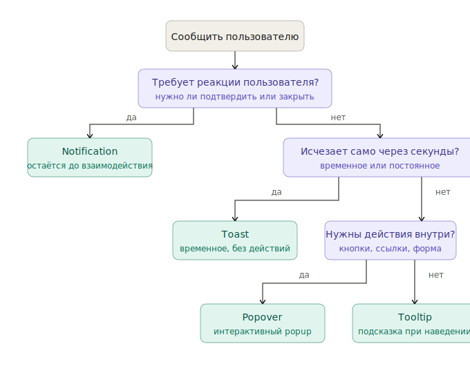

# Как выбрать компонент под задачу

Найдите свою задачу в таблицах ниже. Каждая ссылка ведёт в [reference/components.md](../../reference/components.md), где описана анатомия и пропы.

---

## Уведомить пользователя

| Задача | Компонент | Почему |
|---|---|---|
| Системное уведомление, исчезает само | `Toast` | Временное, не требует действия |
| Важное сообщение, требует реакции | `Notification` | Остаётся до взаимодействия |
| Подсказка при наведении | `Tooltip` | Только текст, без действий |
| Контекстная информация с действиями | `Popover` | Произвольный контент, интерактивен |
| Встроенная заметка в контент | `Note` | Статичная, не overlay |

**Если сомневаетесь** между Toast и Notification: Toast — для «сохранено / отменено», Notification — для «у вас 3 непрочитанных, нужно проверить».

Если решение неочевидно — пройдите по дереву:

---

## Дать выбор из списка

| Задача | Компонент | Почему |
|---|---|---|
| Один вариант из многих (≤5) | `Segment` | Все варианты видны сразу, компактно |
| Один вариант из многих | `RadioBox` (group) | Стандартный радио-выбор |
| Один из многих, dropdown | `Select` (single) | Стандартный выпадающий |
| Несколько из многих | `Select` (multiple) или `CheckBox` (group) | Множественный выбор |
| Ввод + подсказки из списка | `Autocomplete` | Свободный ввод, подсказки опциональны |
| Ввод + только из списка | `ComboBox` | Только из списка, ввод для фильтра |
| Иерархический список | `TreeSelect` | Многоуровневая структура |

**Если сомневаетесь** между Select и Autocomplete: Select — когда варианты фиксированы и их немного, Autocomplete — когда вариантов много и нужен поиск.

---

## Показать панель / диалог

| Задача | Компонент | Почему |
|---|---|---|
| Блокирующий диалог (требует ответа) | `Modal` | Блокирует фон, требует действия |
| Боковая панель, фон доступен | `Drawer` | Не блокирует основной интерфейс |
| Панель снизу (мобильные) | `BottomSheet` | Touch-паттерн, выезжает снизу |
| Действия над выделенным контентом | `ToolBar` | Контекстные действия |

**Modal vs Drawer:** Modal — когда без ответа продолжать нельзя (подтверждение удаления). Drawer — когда панель информативная или редактирование, можно «потом».

---

## Метки и статусы

| Задача | Компонент | Почему |
|---|---|---|
| Числовой счётчик | `Badge` | Компактно, не интерактивен |
| Тег / фильтр (можно удалить) | `Chip` | Интерактивен, есть `hasClose` |
| Статус записи (активен/заблокирован) | `Badge` (`view=positive/negative`) | Семантический цвет |
| Онлайн-статус пользователя | `Avatar` + `Status` | Встроено в аватар |

**Badge vs Chip:** Badge — статика. Chip — пользователь может удалить или нажать.

---

## Загрузка и прогресс

| Задача | Компонент | Почему |
|---|---|---|
| Неопределённая загрузка | `Spinner` | Бесконечная анимация, ждём ответа |
| Загрузка с известным процентом | `Loader` | Показывает прогресс |
| Многошаговая операция | `ProgressBar` | Линейный прогресс |
| Кнопка во время запроса | `Button` с `loading=true` | Спиннер встроен в кнопку |

---

## Если ничего не подходит

Не делайте кастомный компонент сразу. Сначала проверьте:

1. Полный каталог → [reference/components.md](../../reference/components.md)
2. Может быть, ваша задача — комбинация двух компонентов (Popover + List, Card + Chip…)
3. Если действительно нет — пишите в команду SDDS, опишите кейс

Кастомные компоненты внутри SDDS-интерфейса ломают тематизацию: они не подхватят смену темы автоматически.
