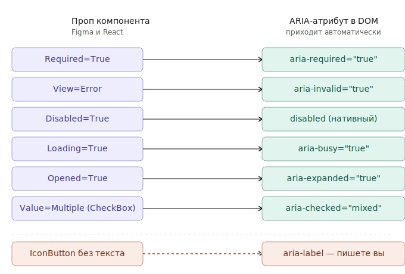
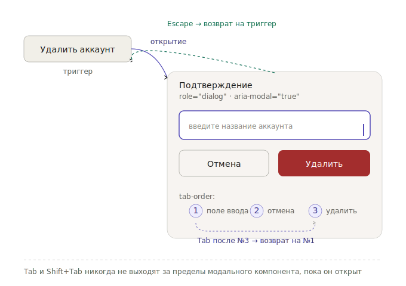

# Reference: доступность

Целевой уровень: **WCAG 2.1 AA**.

---

## Принципы

- **Native-first** — используйте семантический HTML-элемент как основу
- **Visible focus** — кольцо фокуса обязательно для всех интерактивных элементов
- **Keyboard parity** — всё доступное мышью доступно и с клавиатуры
- **No color-only** — состояние не передаётся только через цвет (иконка, текст, форма)

---

## ARIA-роли по компонентам

### Действия

| Компонент | role / семантика | Обязательные атрибуты |
|---|---|---|
| BasicButton, EmbeddedButton | `<button>` | — |
| LinkButton | `<a>` или `<button role="link">` | `href` для `<a>` |
| IconButton | `<button>` | `aria-label` (нет видимого текста) |

### Ввод данных

| Компонент | role / семантика | Обязательные атрибуты |
|---|---|---|
| TextField | `<input>` + `<label>` | `id` + `for` или `aria-label` |
| TextArea | `<textarea>` + `<label>` | `id` + `for` |
| CheckBox | `<input type="checkbox">` | `aria-checked` для indeterminate |
| RadioBox | `<input type="radio">` | обёртка `role="radiogroup"` |
| Switch | `<input type="checkbox" role="switch">` | `aria-checked` |
| Select | `role="combobox"` | `aria-expanded`, `aria-haspopup="listbox"` |
| Autocomplete | `role="combobox"` | `aria-expanded`, `aria-autocomplete` |
| ComboBox | `role="combobox"` | `aria-expanded`, `aria-controls` |
| Slider | `role="slider"` | `aria-valuenow`, `aria-valuemin`, `aria-valuemax` |
| Range | `role="slider"` × 2 | `aria-valuenow`, `aria-valuemin`, `aria-valuemax` на каждом |
| NumberInput | `<input type="number">` | `aria-label` если нет видимого лейбла |

### Навигация

| Компонент | role / семантика | Обязательные атрибуты |
|---|---|---|
| Tabs | `role="tablist"` / `role="tab"` / `role="tabpanel"` | `aria-selected`, `aria-controls` |
| BreadCrumbs | `<nav aria-label="breadcrumb">` + `<ol>` | `aria-current="page"` |
| Pagination | `<nav aria-label="pagination">` | `aria-current="page"` на активной |
| Steps | `role="list"` или `<ol>` | `aria-current="step"` |
| Tree | `role="tree"` / `role="treeitem"` | `aria-expanded` на раскрываемых |
| Accordion | `<button>` + `role="region"` | `aria-expanded`, `aria-controls` |

### Наложения

| Компонент | role / семантика | Обязательные атрибуты |
|---|---|---|
| Modal | `role="dialog"` | `aria-modal="true"`, `aria-labelledby` |
| Drawer | `role="dialog"` | `aria-modal="true"`, `aria-label` |
| BottomSheet | `role="dialog"` | `aria-modal="true"`, `aria-label` |
| Tooltip | `role="tooltip"` | `aria-describedby` на триггере |
| Popover | `role="dialog"` или `role="region"` | `aria-expanded` на триггере |
| Toast | `role="status"` или `role="alert"` | `aria-live` (см. ниже) |
| Notification | `role="alert"` или `role="status"` | `aria-live` |
| ProgressBar | `role="progressbar"` | `aria-valuenow`, `aria-valuemin`, `aria-valuemax` |

### Отображение

| Компонент | role / семантика |
|---|---|
| Note | `role="note"` |
| Badge (счётчик) | `aria-label` с текстовым значением (например, «5 уведомлений») |
| Spinner / Loader | `role="status"` + `aria-label="Загрузка"` |

---

## Пропы → ARIA-атрибуты

Figma-пропы и React-пропы соответствуют ARIA-атрибутам в DOM.

| Проп | ARIA-атрибут |
|---|---|
| `Required=True` / `required` | `aria-required="true"` |
| `View=Error` / `view="error"` | `aria-invalid="true"` |
| `Disabled=True` / `disabled` | `disabled` (нативный) или `aria-disabled="true"` |
| `Loading=True` / `loading` | `aria-busy="true"` |
| `Opened=True` | `aria-expanded="true"` |
| `Value=Multiple` (CheckBox) | `aria-checked="mixed"` |
| `ReadOnly=True` / `readOnly` | `readonly` (нативный) или `aria-readonly="true"` |

---

## Focus trap (модальные компоненты)

Modal, Drawer, BottomSheet захватывают фокус при открытии.

**При открытии:**
- Фокус перемещается на первый интерактивный элемент или на сам контейнер (`aria-modal="true"`)
- `Tab` / `Shift+Tab` цикличны — не выходят за пределы

**При закрытии:**
- Фокус возвращается на элемент, инициировавший открытие
- Если триггер удалён из DOM — фокус на ближайший логический элемент

**Escape** всегда закрывает модальный компонент.

---

## aria-live (динамические уведомления)

Toast и Notification добавляются в DOM динамически — screen reader не объявит их без `aria-live`.

| Компонент | `aria-live` | `aria-atomic` | Когда |
|---|---|---|---|
| Toast `View=Negative` | `assertive` | `true` | Ошибки — объявляются немедленно |
| Toast `View=Default` / `Positive` | `polite` | `true` | Информация — после текущего объявления |
| Notification | `polite` | `true` | Фоновые уведомления |
| Loader / Spinner | `status` | — | Состояние загрузки страницы |

`assertive` прерывает текущее чтение — используйте только для критичных ошибок.

---

## Правила

- Не дублируйте роли на нативных элементах
- Всегда `aria-label`, если нет видимого лейбла (IconButton, icon-only Chip)
- Disabled: используйте нативный `disabled` или `aria-disabled="true"`
- Loading: используйте `aria-busy="true"`, элемент остаётся в tab-order
- Не используйте `
` или `` для интерактивных элементов без причины

---

## Контрастность

| Элемент | Минимум |
|---|---|
| Обычный текст (< 18pt) | 4.5:1 (WCAG AA) |
| Крупный текст (≥ 18pt / bold ≥ 14pt) | 3:1 |
| UI-компоненты и иконки | 3:1 |
| Disabled-состояние | Исключение WCAG 1.4.3 |

---

## Touch targets

- Минимум: 44×44px (WCAG 2.5.8)
- Для маленьких размеров (XXS, XS) зона касания расширяется невидимым padding
