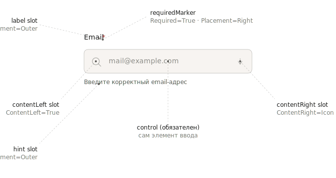
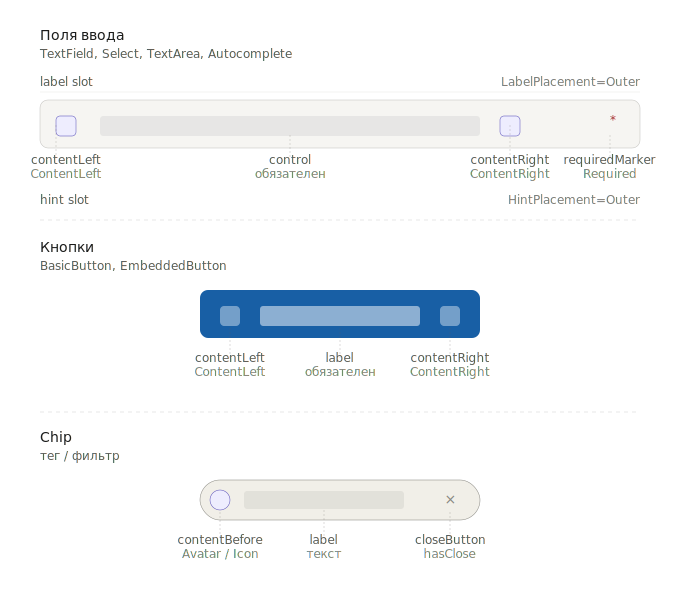

# Reference: пропы

Полный словарь пропов компонентов SDDS.

---

## Категории

| Категория | Пропы |
|---|---|
| Appearance | `View`, `Shape` |
| Layout | `LabelPlacement`, `HintPlacement`, `RequiredPlacement`, `Stretching`, `Spacing` |
| Slots | `ContentLeft`, `ContentRight`, `ContentBefore`, `ContentAfter`, `hasLabel`, `hasDescription`, `hasClose` |
| Data | `Value`, `Opened`, `EmptyState` |
| Availability | `Disabled`, `ReadOnly`, `Required` |
| Interaction | `Focused`, `Turn On` |
| Async | `Loading` |
| Component-specific | `Status`, `isCirculed`, `ToggleSize`, `Clip`, `Stretch`, `hasDivider` |

---

## Slot model

**Слот** — именованная позиция внутри компонента, в которую помещается контент. Слоты управляются пропами: компонент не знает, что попадёт в слот, только отображает или скрывает позицию.

Анатомия TextField со всеми слотами и связанными пропами:

Аналогичная структура — у кнопок и Chip, но с другим набором слотов:

### Слоты форм (TextField, Select, TextArea)

| Слот | Проп | Описание |
|---|---|---|
| `label` | `LabelPlacement` | Текстовая метка |
| `control` | — | Сам элемент ввода (обязателен) |
| `hint` | `HintPlacement` | Подсказка / текст ошибки |
| `contentLeft` | `ContentLeft=True` | Иконка/элемент слева |
| `contentRight` | `ContentRight` | Иконка/элемент справа |
| `requiredMarker` | `Required=True` + `RequiredPlacement` | Маркер обязательного поля |

### Слоты кнопок (BasicButton, EmbeddedButton)

| Слот | Проп | Описание |
|---|---|---|
| `label` | — | Текст (обязателен) |
| `contentLeft` | `ContentLeft=True` | Иконка слева |
| `contentRight` | `ContentRight` | Иконка/значение справа |
| `spinner` | `Loading=True` | Спиннер при загрузке |

### Слоты Badge / Chip

| Слот | Проп | Описание |
|---|---|---|
| `contentLeft` | `ContentLeft=True` | Иконка слева |
| `label` | `Label=True` | Текст |
| `contentRight` | `ContentRight=True` | Иконка/значение справа |
| `contentBefore` | `ContentBefore` | Avatar/Icon (только Chip) |
| `closeButton` | `hasClose=True` | Кнопка удаления (только Chip) |

---

## Appearance

### `View`

Семантическая вариация. **Два набора в зависимости от типа компонента.**

**Компоненты (Button, Badge, Chip, Toast, Notification):**

| Значение | Смысл |
|---|---|
| `Default` | Нейтральный |
| `Accent` | Брендовый акцент |
| `Secondary` | Вторичный |
| `Positive` | Успех / позитивное действие |
| `Warning` | Предупреждение |
| `Negative` | Деструктивное / опасное |
| `Info` | Информационный (LinkButton, EmbeddedButton) |
| `Clear` | Прозрачный фон (BasicButton) |
| `Dark` / `Black` / `White` | Фиксированные цвета, не зависят от темы |
| `Custom` | Произвольный (только Badge) |
| `Checked` | Выбранное (только IconButton) |

**Поля ввода (TextField, Select, TextArea, Autocomplete):**

| Значение | Смысл |
|---|---|
| `Default` | Нейтральное |
| `Error` | Ошибка валидации |
| `Warning` | Предупреждение |
| `Success` | Успешная валидация |

`Warning` — единственное значение в обоих наборах. См. [view-vs-state](../../concepts/view-vs-validation.md).

### `Shape`

Форма контейнера.

| Значение | Описание | Компоненты |
|---|---|---|
| `Default` | Скругление по токену | Badge, Chip, IconButton |
| `Pilled` | Полностью скруглённый | Badge, Chip, IconButton |

---

## Layout

### `LabelPlacement`
| Значение | Описание |
|---|---|
| `Outer` | Лейбл над полем (по умолчанию) |
| `Inner` | Floating внутри поля |
| `None` | Скрыт |

Компоненты: TextField, Select, TextArea, Autocomplete, ComboBox.

### `HintPlacement`
| Значение | Описание |
|---|---|
| `Outer` | Под полем |
| `Inner` | Внутри поля при пустом значении |

### `RequiredPlacement`
| Значение | Описание |
|---|---|
| `Left` | Слева от лейбла |
| `Right` | Справа от лейбла |
| `None` | Скрыт |

Активен только при `Required=True`.

### `Stretching` (BasicButton)
| Значение | Описание |
|---|---|
| `Auto` | Ширина по контенту |
| `Fixed` | Фиксированная ширина |

### `Spacing` (BasicButton)
| Значение | Описание |
|---|---|
| `Packed` | Контент прижат друг к другу |
| `Space Between` | Иконки к краям, текст по центру |

Актуально при `Stretching=Fixed`.

---

## Slots

### `ContentLeft`
boolean — иконка/элемент слева. Компоненты: Button, Badge, Chip, TextField.

### `ContentRight`
- BasicButton: enum — `None` / `Value` / `Icon`
- LinkButton, Badge: boolean

### `ContentBefore` (Chip)
| Значение | Описание |
|---|---|
| `Empty` | Нет контента |
| `Icon` | Иконка |
| `Avatar` | Аватар |

### `ContentAfter` (Chip)
boolean.

### `hasLabel`
- Switch: `True` / `False`
- CheckBox: `Yes` / `No` ⚠️ (несоответствие конвенции)

### `hasDescription` (CheckBox)
`Yes` / `No` ⚠️

### `hasClose` (Chip, Toast)
boolean.

---

## Data

### `Value`

| Значение | Смысл | Компоненты |
|---|---|---|
| `Empty` | Нет значения | TextField, Select, TextArea |
| `Single` | Одно значение / отмечен | TextField, Select, CheckBox |
| `Multiple` | Несколько / частично отмечен | TextField, Select, CheckBox |
| `Filled` | Есть значение (общий случай) | Select, Autocomplete |

`Value` ≠ `View`. Наличие значения не означает валидности.

### `Opened`
boolean. Компоненты: Select, DatePicker, ComboBox, Autocomplete.

### `EmptyState` (Select)
boolean — список пуст, нет вариантов.

---

## Availability

### `Disabled`
boolean. Все интерактивные компоненты. Исключается из tab-order.
Отменяет hover, focus, active, error.

### `ReadOnly`
boolean. TextField, Select, TextArea. Остаётся в tab-order, значение копируется.

`ReadOnly` ≠ `Disabled`.

### `Required`
boolean. TextField, Select, TextArea, Autocomplete.
Декларативный атрибут, **не триггер валидации**. Ошибку показывает `View=Error`.

---

## Interaction

### `Focused`
boolean. В реализации — нативный `:focus`, в Figma — симулированное состояние.

### `Turn On` (Switch)
enum: `on` / `off`. ⚠️ Имя пропа содержит пробел.
Не путать с `checked`.

---

## Async

### `Loading`
boolean. Button, IconButton.
- Заменяет контент кнопки спиннером
- Фиксирует ширину
- Блокирует повторное взаимодействие
- Кнопка остаётся в tab-order (это **не** disabled)

---

## Component-specific

### `Status` (Avatar)
| Значение | Описание |
|---|---|
| `Default` | Без статуса |
| `Active` | Онлайн |
| `Inactive` | Офлайн |

### `isCirculed` (Avatar)
boolean — кольцо вокруг аватара.

### `ToggleSize` (Switch)
| Значение | px |
|---|---|
| `28 L` | 28 |
| `20 S` | 20 |

### `Clip` (Tabs)
| Значение | Описание |
|---|---|
| `None` | Обрезаются без контрола |
| `Show More` | Кнопка «Ещё» |
| `Scroll` | Горизонтальная прокрутка |

### `Stretch` (Tabs)
boolean — растягивание на ширину контейнера.

### `hasDivider` (Tabs)
boolean — разделитель под панелью.

---

## Известные несоответствия конвенции

| Проп | Проблема | Компонент |
|---|---|---|
| `hasLabel`, `hasDescription` | `Yes`/`No` вместо `True`/`False` | CheckBox |
| `Turn On` | Пробел в имени пропа | Switch |
| `Disabled`, `Loading`, `Focused` | Непоследовательный регистр в Figma | Разные |
| `View=Seccondary` | Опечатка | Button 24 XXS |

---

## Правила

- `View` на полях (`Error`/`Warning`/`Success`) ≠ `View` на компонентах (`Negative`/`Warning`/`Positive`). См. [view-vs-state](../../concepts/view-vs-validation.md).
- `Required` — декларативный, не триггер валидации.
- `ContentLeft`/`ContentRight` — слоты, не иконки. Иконку или другой контент выбираете вы.
- `Value` на CheckBox кодирует выбор (`Empty`/`Single`/`Multiple`), не текст.
- `Opened=True` без `Value=Filled` — валидно (открытый пустой список).
