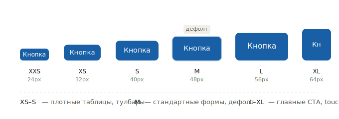
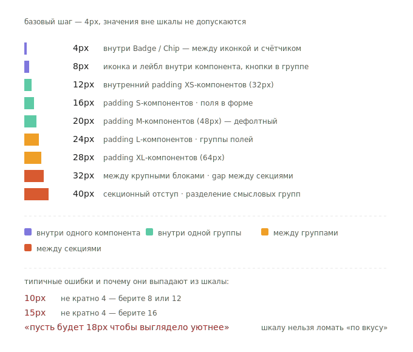

# Reference: размеры и отступы

Размерная шкала компонентов и шкала отступов между ними.

---

## Размеры компонентов

SDDS использует шесть ступеней.

| T-shirt | px | Контекст |
|---|---|---|
| `XXS` | 20–24 | Очень компактные: встроенные чипы, мини-кнопки |
| `XS` | 32 | Тулбары, плотные таблицы, inline-действия |
| `S` | 40 | Вторичные формы, плотные карточки |
| `M` | 48 | **Дефолт.** Стандартные формы |
| `L` | 56 | Акцентные CTA, крупные формы |
| `XL` | 64 | Hero-секции, touch-first интерфейсы |

Дополнительно для Avatar: `XXL` (нестандартный размер).

Шкала визуально:



### Паттерн именования в Figma

```
ComponentName {px} {T-shirt}
```

Примеры: `BasicButton 48 M`, `TextField 56 L`, `Chip 24 XS`.

---

## Применение по компонентам

| Компонент | Доступные размеры |
|---|---|
| BasicButton | XXS(24), XS(32), S(40), M(48), L(56), XL(64) |
| LinkButton | XXS(24), XS(32), S(40), M(48), L(56), XL(64) |
| IconButton | XXS(24), XS(32), S(40), M(48), L(56), XL(64) |
| EmbeddedButton | S, M, L |
| TextField | XS(32), S(40), M(48), L(56), XL(64) |
| Select | XS(32), S(40), M(48), L(56), XL(64) |
| CheckBox | S, M, L |
| Switch | S, M, L |
| Badge | XS, S, M, L |
| Chip | XXS(20), XS(24), S(32), M(40), L(48) |
| Avatar | S(24), M, L, XL, XXL |
| Tabs | XS, S, M, L |

---

## Принципы выбора размера

- **Один размер на контекст.** Форма, таблица или панель — одна ступень.
- **M — дефолт.** Если нет явной причины отклоняться.
- **Размер как иерархия.** L/XL — главные CTA, XS/S — вторичные.
- **Не смешивайте размеры в одной строке** — визуальный шум.
- **Touch-first** — на мобильных предпочтительны L/XL (минимум 44×44px зоны касания).

---

## Шкала отступов

Базовый шаг: **4px**. Все значения кратны 4 — произвольные числа не допускаются.

> SDDS не использует отдельные spacing-переменные. Компоненты применяют значения напрямую как hardcoded px. Шкала ниже — справочник допустимых значений.

| px | Применение |
|---|---|
| 4px | Внутренние отступы мелких элементов, gap внутри Badge/Chip |
| 8px | Между иконкой и лейблом внутри компонента |
| 12px | Внутренний padding XS-компонентов |
| 16px | Внутренний padding S-компонентов |
| 20px | Внутренний padding M-компонентов |
| 24px | Внутренний padding L-компонентов |
| 28px | Внутренний padding XL-компонентов |
| 32px | Между крупными блоками, gap между секциями формы |
| 40px | Секционный отступ, разделение смысловых групп |

Та же шкала визуально, с цветовыми группами по контексту применения:



---

## Внутренние отступы компонентов

### Кнопки и поля ввода (горизонтальный padding)

| Размер | Высота | Padding H |
|---|---|---|
| XS | 32px | 12px |
| S | 40px | 16px |
| M | 48px | 20px |
| L | 56px | 24px |
| XL | 64px | 28px |

Горизонтальный padding полей и кнопок одной ступени совпадает — это обеспечивает выравнивание при соседстве в строке.

---

## Расстояния между компонентами

Шкала та же. Конкретные значения по контексту:

| Контекст | Gap |
|---|---|
| Иконка и лейбл внутри компонента | 8px |
| Поля в inline-группе (TextField + Button) | 8px |
| Поля в вертикальной форме | 16px |
| Группы полей между собой | 24px |
| Секции формы / смысловые блоки | 32–40px |
| Отдельные карточки / панели | 16–24px |

---

## Правила

- Используйте только значения из шкалы — никаких произвольных чисел
- Сохраняйте вертикальный ритм: всё кратно 4px
- Иконка и лейбл — 8px
- Не уменьшайте gap между полями ниже 16px
- Один размер отступа на контекст: не смешивайте 16px и 24px между полями одной формы
