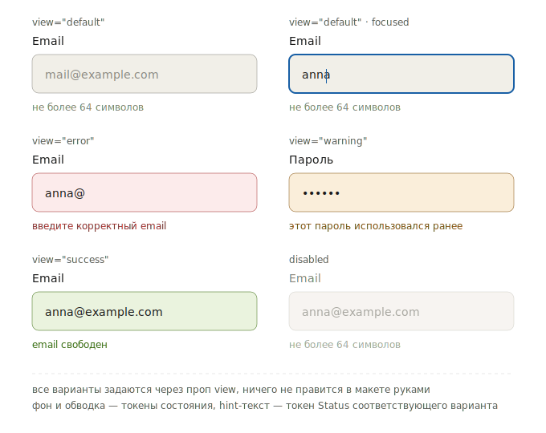
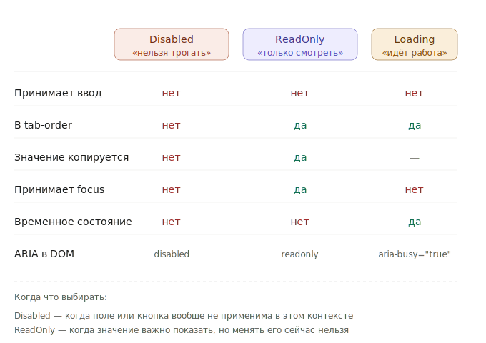

# Reference: состояния

Состояния компонентов SDDS: определения, Figma-пропы, правила комбинирования.

---

## Категории

| Категория | Состояния |
|---|---|
| Interaction | `hover`, `focus`, `active/pressed` |
| Selection | `checked`, `indeterminate`, `on/off` |
| Data | `filled`, `opened` |
| Validation (поля ввода) | `error`, `warning`, `success` |
| Semantic View (компоненты) | `negative`, `warning`, `positive` |
| Availability | `disabled`, `read-only` |
| Async | `loading` |

---

## Interaction

| Состояние | Описание | Figma-проп | Компоненты |
|---|---|---|---|
| `default` | Начальный вид | — | Все |
| `hover` | Курсор наведён. Только обратная связь, не означает выбор | — | Button, Chip, Badge, DropdownMenu, Tabs |
| `active/pressed` | Момент нажатия. **Не означает выбранность** | — | Button, Chip, Link |
| `focus` | Фокус клавиатуры. Всегда видимое кольцо фокуса | `Focused=True` | Button, TextField, CheckBox, RadioBox, Select |

---

## Selection

| Состояние | Описание | Figma-проп | Компоненты |
|---|---|---|---|
| `checked` | Бинарный выбор | `Value=Single` | CheckBox |
| `indeterminate` | Частично выбранное (родительский CheckBox) | `Value=Multiple` | CheckBox |
| `on/off` | Включено/выключено. Не заменяет `checked` | `Turn On=on/off` | Switch |

---

## Data

| Состояние | Описание | Figma-проп | Компоненты |
|---|---|---|---|
| `filled` | Есть значение. **Не означает валидность** | `Value=Single/Multiple/Filled` | TextField, Select, Autocomplete |
| `opened` | Раскрыт (выпадающий список, календарь) | `Opened=True` | Select, DatePicker, ComboBox |

---

## Validation (поля ввода)

Применяются **только** к полям ввода. Задаются через `View`.

| Состояние | Figma | Когда |
|---|---|---|
| `error` | `View=Error` | После взаимодействия, при невалидных данных |
| `warning` | `View=Warning` | Данные допустимы, но рискованны |
| `success` | `View=Success` | После успешной проверки |

Визуально все варианты выглядят так:

---

## Semantic View (компоненты)

Применяются к **компонентам** (Button, Badge, Chip, Toast). Задаются через `View`.

| Figma-проп | Описание | Компоненты |
|---|---|---|
| `View=Negative` | Деструктивное / опасное | Button, Badge, Chip, CheckBox, Toast |
| `View=Warning` | Предупреждение | Button, Badge, Chip, Toast |
| `View=Positive` | Успешное / позитивное | Button, Badge, Chip, Toast |

### Различие

| Контекст | Ошибка | Успех | Figma View |
|---|---|---|---|
| Поля ввода | `error` | `success` | `View=Error` / `View=Success` |
| Компоненты | `negative` | `positive` | `View=Negative` / `View=Positive` |

> **Почему так** — в [view-vs-state](../../concepts/view-vs-validation.md).

`Warning` — единственное состояние в обоих наборах. Визуально использует те же токены, разграничение контекстное.

---

## Availability

| Состояние | Описание | Figma-проп | Компоненты |
|---|---|---|---|
| `disabled` | Недоступен. Блокирует hover/focus/active. Исключается из tab-order | `Disabled=True` | Все интерактивные |
| `read-only` | Доступен для чтения. Остаётся в tab-order, копируется | `ReadOnly=True` | TextField, Select, TextArea |

---

## Async

### `loading`

Только для Button и IconButton.
**Figma-проп:** `Loading=True`

- Блокирует повторное взаимодействие
- Заменяет контент спиннером
- Ширина фиксируется
- Не эквивалентен `disabled`: семантически кнопка активна

### Disabled vs ReadOnly vs Loading

Эти три состояния путают чаще всего. Снаружи похожи (поле или кнопка «не работают»), но семантически — разные:

---

## Комбинирование состояний

| Состояние | + `focus` | + `filled` | + `error` | + `disabled` | + `loading` |
|---|---|---|---|---|---|
| `default` | ✓ | ✓ | ✓ | ✓ | ✓ |
| `filled` | ✓ | — | ✓ | ✓ | — |
| `error` | ✓ | ✓ | — | ✗ | — |
| `disabled` | ✗ | ✓ | ✗ | — | ✗ |
| `loading` | ✗ | — | — | ✗ | — |
| `read-only` | ✓ | ✓ | ✗ | ✗ | — |

Ключевые правила:

- `disabled` отменяет `hover`, `focus`, `active`, `error`
- `loading` отменяет `hover`, `focus`, `active`, но не `disabled`
- Поле может быть одновременно `filled` + `error` + `focus` — типичный сценарий валидации
- `read-only` и `disabled` взаимоисключающие

---

## Визуальное наложение

### Поле: `filled` + `error` + `focus`

Типичный сценарий валидации.

| Слой | Токен |
|---|---|
| Фон поля | `Surfaces/Default/Status/Transparent/Negative` |
| Обводка | `Outlines/Default/Status/Solid/Negative` |
| Кольцо фокуса | компонентный токен фокус-кольца (поверх обводки) |
| Текст значения | `Text&Icons/Default/General/Primary` |
| Текст ошибки | `Text&Icons/Default/Status/Negative` |

`error` определяет цвет поверхности и обводки, `focus` рисует своё кольцо сверху.

### Кнопка: `hover` + `disabled`

`disabled` отменяет `hover` полностью — приглушённые токены не меняются при наведении.

### Кнопка: `loading`

Спиннер заменяет контент. Токены поверхности — от базового `default`. Loading не вводит отдельный цвет фона.

---

## Правила

- `active` ≠ `selected` — активация ≠ выбор
- `checked` ≠ `selected` — CheckBox использует `checked`
- Switch использует `on/off`, не `checked`
- `filled` ≠ `valid` — наличие значения ≠ корректность
- `disabled` ≠ `read-only` — disabled блокирует всё, read-only оставляет доступ
- `loading` ≠ `disabled` — разные семантики
- Кольцо фокуса всегда поверх остальных состояний — никогда не скрывайте
- Не показывайте `Error`/`Warning` до того, как пользователь коснулся поля
