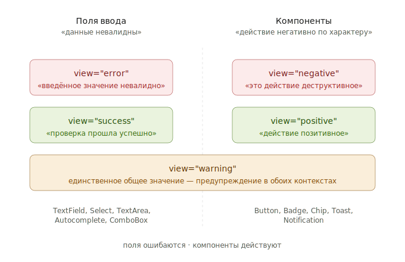

# View vs State: почему `error` ≠ `negative`

Зачем читать: понять, почему в SDDS два разных набора `View` и почему в одном случае пишут `Error`, а в другом — `Negative`. Это самая частая точка путаницы у новичков.

---

## Проблема

В SDDS у двух разных типов компонентов значения `View` различаются.

Первая реакция: «это непоследовательно, давайте использовать одно слово». Но это не баг — это намеренное разделение, и вот почему.

---

## Поля ошибаются. Компоненты — действуют

У этих двух типов компонентов **разная семантика того, что вы выражаете цветом**.

### Поле ввода с красной обводкой

«Введённое значение **невалидно**». Это сообщение об ошибке состояния. Поле:

- Может перестать быть в этом состоянии (пользователь исправил)
- Сообщает о факте: «данные не подходят»
- Слово `error` описывает это точно

### Кнопка с красным фоном

«Это действие **деструктивное / опасное**». Это не сообщение об ошибке — кнопка не находится в неправильном состоянии. Она просто такая по смыслу.

- Это её постоянное предназначение, не временное состояние
- Сообщает о намерении: «то, что произойдёт при клике, имеет негативный характер»
- Слово `negative` описывает это точно

Слово `error` для кнопки удаления было бы неправильным: кнопка не находится в ошибочном состоянии. Слово `negative` для поля было бы расплывчатым: поле не «негативное», оно невалидное.

---

## Тот же принцип для успеха

| Контекст | Слово | Почему |
|---|---|---|
| Поле | `success` | Валидация **прошла успешно** — это про результат проверки |
| Компонент | `positive` | Действие **позитивное по характеру** (Подтвердить, Сохранить) |

Toast `view="positive"` — «у меня хорошая новость». Поле `view="success"` — «то, что вы ввели, корректно». Разные смыслы.

---

## Почему важно различать

Если бы у Toast был `view="success"`, а у поля `view="success"` — система бы внешне выглядела стройнее, но внутренне путала разные вещи. Компонент-проектировщик и пользователь системы не различали бы, говорим ли мы про **факт корректности данных** или про **характер сообщения**.

В большой дизайн-системе это всплывает быстро:

- Что делать с `Notification`, который сообщает об ошибке? У него ошибка как факт (`error`) или как характер сообщения (`negative`)? Если `error` — почему у Toast `negative`?
- Что делать с `Tag`, отмечающим успешный статус документа? Это `success` (документ валиден) или `positive` (хорошее свойство)?

SDDS отвечает на это разделением: **поля ввода** говорят про **состояние данных** (`error`/`success`), **остальные компоненты** говорят про **семантический характер** (`negative`/`positive`).

В каждом конкретном случае слово выбирается осмысленно, не механически.

---

## Что про Warning

`Warning` — единственное слово, которое одинаково на полях и компонентах.

| Контекст | Смысл |
|---|---|
| Поле | «Данные допустимы, но могут вызвать проблемы» |
| Компонент | «Действие или информация имеет предупредительный характер» |

И там, и там — это про предупреждение. Разделять `warning`/`caution` не было нужно — слово достаточно общее, чтобы покрыть оба случая. Визуально оба используют одни и те же `Warning`-токены.

---

## Шпаргалка

| Хотите выразить | Используйте | Где |
|---|---|---|
| «Введённое значение невалидно» | `view="error"` | TextField, Select, TextArea, Autocomplete |
| «Введённое значение корректно» | `view="success"` | TextField, Select, TextArea, Autocomplete |
| «Это действие удалит / разрушит» | `view="negative"` | Button, IconButton |
| «Это действие позитивное / подтверждающее» | `view="positive"` | Button, Toast, Badge |
| «Эта запись отмечена как ошибка» | `view="negative"` | Badge, Chip |
| «Это уведомление об ошибке системы» | `view="negative"` | Toast, Notification |
| «Предупреждение, осторожно» | `view="warning"` | И там, и там |

---

## Куда дальше

- [Reference: пропы — View](../../reference/props.md#view)
- [Reference: состояния](../../reference/states.md)
- [How-to: добавить валидацию](../../guides/handle-validation.md)
