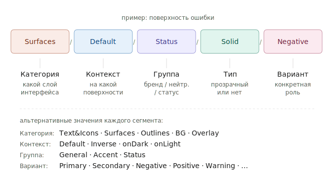

# Почему семантические токены

Зачем читать: понять, чем `Text&Icons/Default/Status/Negative` отличается от `red-500` и почему SDDS пошла именно таким путём.

---

## Проблема, которую токены решают

Представьте классический подход к цветам:

```css
.button-error {
  background: #F5283C;   /* красный */
  color: #FFFFFF;
}
.text-error {
  color: #F5283C;
}
.alert-error {
  border: 1px solid #F5283C;
}
```

Здесь `#F5283C` встречается в трёх местах. Когда дизайнер обновляет красный — нужно найти и поменять все вхождения. Если что-то пропустили — у вас несогласованные оттенки.

Решение: **переменные**.

```css
:root {
  --red-500: #F5283C;
}

.button-error { background: var(--red-500); }
.text-error { color: var(--red-500); }
.alert-error { border-color: var(--red-500); }
```

Теперь обновить красный — это правка в одном месте. Это **сырые токены** (raw / primitive tokens).

---

## Чего сырых токенов не хватает

Допустим, появляется dark theme. Что должно произойти с `--red-500`?

- Если это «красный для ошибок» — он должен стать ярче на тёмном фоне. Например, `#FF5C6E` для лучшей контрастности.
- Если это «красный для брендового лого» — он должен остаться `#F5283C`.

С именем `--red-500` мы не знаем, что это за красный и как с ним поступать. Имя описывает **цвет**, а не **роль**.

Решение: давать токенам имена, описывающие роль.

```css
:root {
  --text-icons-default-status-negative: #F5283C;   /* light theme */
}

[data-theme="dark"] {
  --text-icons-default-status-negative: #FF5C6E;   /* dark theme */
}
```

Это **семантические токены**. Их имя описывает, **зачем** этот цвет нужен, а не какой он.

---

## Почему такая длинная схема имени

```
Text&Icons / Default / Status / Solid / Negative
```



Разберём по сегментам:

| Сегмент | Что говорит | Что меняется |
|---|---|---|
| `Text&Icons` | На какой части интерфейса работает | Поверхность ≠ текст ≠ обводка |
| `Default` | На какой поверхности находится | На тёмной поверхности нужны другие цвета |
| `Status` | К какой группе относится | Бренд / нейтральные / статусы |
| `Solid` | Прозрачный или нет | Влияет на контрастность |
| `Negative` | Конкретная роль | Ошибка vs успех vs предупреждение |

Каждый сегмент несёт смысл. Вместе они однозначно описывают «какой это цвет и где его применять» — без апелляции к конкретному значению.

---

## Что даёт такая структура

### 1. Тема меняется без правки компонентов

Компонент TextField обращается к `Surfaces/Default/Status/Transparent/Negative`. При смене темы значение меняется, имя — нет. Компонент работает в любой теме.

### 2. Контексты как первый класс

Один и тот же текст может находиться на светлом или тёмном фоне. Сырые токены этого не знают. Семантические — знают: это второй сегмент имени.

```
Text&Icons/Default/General/Primary    ← на основном фоне
Text&Icons/onDark/General/Primary     ← на гарантированно тёмном
```

### 3. Согласованность через систему, а не через дисциплину

Без семантических токенов согласованность между компонентами держится на дисциплине: «не забудьте использовать `--red-500` для ошибок». В SDDS она держится на структуре: для ошибок есть только один токен.

### 4. Проверка на корректность

Если компонент использует `Text&Icons/Default/Status/Negative` для текста кнопки «Зарегистрироваться» — это сразу странно. Имя токена сигнализирует: «это про ошибку, ты уверен, что хочешь это здесь?». Сырой `--red-500` такой подсказки не даёт.

---

## Цена

Семантические токены требуют дисциплины при создании. Вы должны решить:

- Какие категории нужны (`Text&Icons`, `Surfaces`, `Outlines`, …)
- Какие контексты (`Default`, `Inverse`, `onDark`, …)
- Какие группы (`General`, `Accent`, `Status`)
- Какие варианты внутри группы

Если переусложнить — токенов станет слишком много, дизайнеры и разработчики будут путаться. Если упростить — не хватит выразительности для разных кейсов.

SDDS прошла эту калибровку. Структура `Категория / Контекст / Группа / Тип / Вариант` — компромисс между выразительностью и читаемостью.

---

## Что из этого следует

- Не используйте сырые цвета (`#F5283C`) в макете или коде. Только токены.
- Не выдумывайте свои имена токенов. Если в SDDS нет нужной роли — обсуждайте с командой, это расширение системы.
- При выборе токена смотрите на смысл: что вы хотите выразить? «Поверхность ошибки» — это `Surfaces/…/Status/…/Negative`, а не «найди мне красный».

---

## Куда дальше

- [Архитектура SDDS](../../concepts/architecture.md) — где токены живут в системе
- [Принцип white-label](../../foundations/theming.md) — что становится возможным благодаря токенам
- [Reference: токены](../../reference/tokens.md) — полный список
