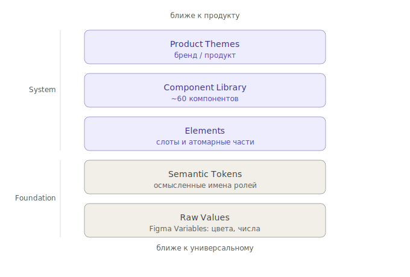

# Архитектура: пять слоёв

Зачем читать: понять, из чего состоит SDDS и почему. После этого станет понятно, почему правки обычно делаются на одном слое и не ломают остальные.

---

## Пять слоёв



Каждый слой строится на предыдущем. Чем выше слой — тем ближе к продукту, чем ниже — тем универсальнее. Нижние два слоя — Foundation (правила и значения), верхние три — System (компоненты, которые этими правилами пользуются).

---

## 1. Raw Values (Figma Variables)

Сырые значения. Хранятся в четырёх коллекциях:

| Коллекция | Тип | Что хранит |
|---|---|---|
| `01. Theme` | COLOR | Основная палитра |
| `02. SubTheme` | COLOR | Альтернативный набор |
| `03. Typography` | FLOAT | Размеры шрифта, межстрочные интервалы |
| `04. Numbers` | FLOAT | Радиусы скругления |

На этом слое — никакой семантики. Только: «это число — 24, это цвет — `#F5283C`».

---

## 2. Semantic Tokens

Имена для значений с описанием роли.

```
Surfaces/Default/Status/Solid/Negative   ← это поверхность ошибки
```

Слой нужен потому, что значения меняются, а роли — нет. Когда дизайнер обновляет красный для ошибок — никто не правит компоненты, потому что они обращаются к роли «поверхность ошибки», а не к конкретному цвету.

→ Подробнее: [why-semantic-tokens](why-tokens.md).

---

## 3. Elements

Атомарные части, из которых собираются компоненты: слоты `contentLeft`, `label`, `contentRight`, `hint`.

Слой отвечает на вопрос: «как у TextField и Select получается одинаковая анатомия?». Ответ: оба собраны из общих слотов, не из собственных уникальных частей.

→ Подробнее: [reference/props.md](../reference/props.md) (раздел Slot model).

---

## 4. Component Library

~60 компонентов, разделённых на четыре функциональные категории:

| Категория | Назначение | Примеры |
|---|---|---|
| Data Display | Отображение информации | Badge, Avatar, Card, Cell, Chip, Spinner |
| Data Entry | Ввод и редактирование | TextField, Select, CheckBox, Button, DatePicker |
| Overlay | Наложения и уведомления | Modal, Drawer, Toast, Tooltip, Popover |
| Navigation | Перемещение по интерфейсу | Tabs, BreadCrumbs, Pagination, DropdownMenu |

Каждый компонент имеет:

- Размерную шкалу — XXS … XL
- View-варианты — `Default`, `Accent`, `Negative` и т.д.
- Состояния — interaction, validation, availability, async

→ Подробнее: [reference/components.md](../reference/components.md).

---

## 5. Product Themes

Верхний слой. Набор значений токенов для конкретного продукта или бренда.

Чтобы сменить тему — подменяется коллекция Figma Variables (или JSON-файл темы в коде). Компоненты не меняются.

→ Подробнее: [how-to/theme-a-product.md](../guides/theme-a-product.md).

---

## Платформы

SDDS покрывает Web и Mobile через единый Figma-файл и общий набор токенов.

| Платформа | Контексты | Особенности |
|---|---|---|
| Web | Десктоп, адаптив | Полный набор компонентов, плотные размеры (XS–M) |
| Mobile | iOS, Android | Touch-ориентированные размеры (L–XL), платформо-специфичные компоненты |

Компоненты, специфичные для мобильных: `BottomSheet`, `TabBar`, `PaginationDots`, `Tour`. На вебе им соответствуют `Drawer`, `Tabs`, `Pagination`.

---

## Core principles

**Token-first.** Все визуальные решения выражены через семантические токены. Компонент никогда не обращается к конкретному цвету (`#1A1A1A`), только к токену (`Text&Icons/Default/General/Primary`).

**White-label ready.** Тема подключается снаружи. Компоненты не содержат захардкоженных значений — один компонент корректно отображает любой бренд без правки слоёв.

**Composable.** Компоненты собираются из стандартных слотов. Новый компонент не изобретает собственную анатомию, использует готовые части.

**Scalable.** Система растёт через добавление тем, размеров и View-вариантов, а не через правку существующих компонентов.

---

## Что из этого следует

- Меняете тему → правите только Product Theme. Не правите компоненты.
- Хотите новый компонент → собирайте из существующих слотов и токенов. Не выдумываете новые.
- Меняется бренд-цвет → правите Raw Values, не компоненты.
- Хотите использовать SDDS на новом продукте → создаёте новую Product Theme, всё остальное переиспользуете.

---

## Куда дальше

- [Принцип white-label](../foundations/theming.md)
- [Почему семантические токены](why-tokens.md)
- [Reference: токены](../reference/tokens.md)
- [Reference: компоненты](../reference/components.md)
