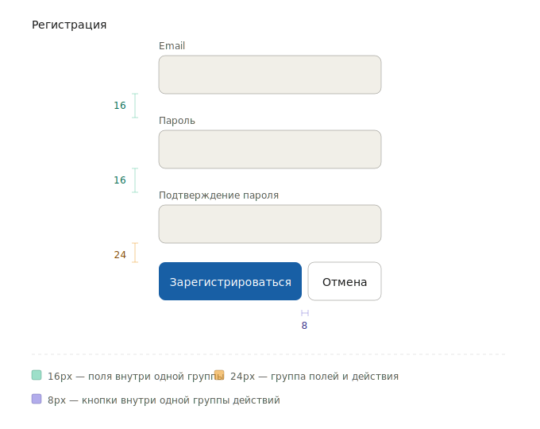

# Как собрать форму

Полный рецепт: от пустого фрейма до формы с лейблами, маркерами обязательности, валидацией и состоянием отправки.

**Перед чтением:** базовое понимание компонентов SDDS. Если только начинаете — [Getting Started](../getting-started/01-getting-started-designer.md).

---

## 1. Выберите размер

Один размер на всю форму. Не смешивайте.

| Контекст | Размер |
|---|---|
| Стандартная форма на десктопе | **M (48px)** ← дефолт |
| Плотный интерфейс, таблицы | S (40px) |
| Касание / мобильные | L (56px) |
| Hero-форма, лендинг | XL (64px) |

Не уверены — берите **M**.

---

## 2. Стандартный набор полей

```tsx
<TextField size="m" labelPlacement="outer" label="Имя" required />
<TextField size="m" labelPlacement="outer" label="Email" required hint="mail@example.com" />
<Select   size="m" labelPlacement="outer" label="Страна" required options={[…]} />
<TextArea size="m" labelPlacement="outer" label="Комментарий" />
```

Принципы:

- **`labelPlacement="outer"`** — лейбл над полем. Используйте по умолчанию: его проще читать, особенно длинные.
- **`labelPlacement="inner"`** (floating) — только когда вертикальное пространство критично (мобильные формы, плотные интерфейсы).
- **`hint`** — подсказка под полем. Используйте для формата (`mail@example.com`, `+7 999 123-45-67`).

---

## 3. Отметьте обязательные поля

Два варианта, выбираете в зависимости от соотношения:

### Большинство полей обязательны → отмечайте необязательные

```tsx
<TextField label="Имя" required requiredPlacement="right" />
<TextField label="Email" required requiredPlacement="right" />
<TextField label="Телефон" optional />              {/* ← редкий случай */}
```

В тексте над формой: «Поля без пометки обязательны» не нужно — пометка `Optional` сама говорит.

### Большинство полей необязательны → отмечайте обязательные

```tsx
<TextField label="Email" required requiredPlacement="right" />  {/* ← редкий случай */}
<TextField label="Имя" />
<TextField label="Никнейм" />
```

### Все поля обязательны

Поставьте текст «Все поля обязательны» над формой. Маркер `*` на каждом поле — визуальный шум.

> **Что делает `required`?** Только маркер `*`. Это **не** триггер валидации — поле не покажет ошибку само. Ошибку показываете вы через `view="error"` при submit. Подробнее → [как добавить валидацию](handle-validation.md).

---

## 4. Расположите поля

Шкала отступов SDDS — кратна 4px. Для форм:

| Что | Отступ |
|---|---|
| Между полями в форме | **16px** |
| Между группами полей (например, «Контакты» и «Адрес») | 24–32px |
| Между секциями формы | 32–40px |
| Между полем и кнопкой submit | 24px |
| Группа полей в одну строку (например, «Город» + «Индекс») | 8px |

> **Не уменьшайте gap между полями ниже 16px** — поля сливаются, и пользователь не видит границы.

Полная шкала → [reference/sizes-and-spacing.md](../reference/spacing.md).

Как это выглядит на типичной форме регистрации:



---

## 5. Кнопки submit и cancel

```tsx
<div style={{ display: 'flex', gap: 8 }}>
  <Button view="accent" size="m" type="submit">Сохранить</Button>
  <Button view="default" size="m" type="button" onClick={onCancel}>Отмена</Button>
</div>
```

Правила:

- **Главное действие — `view="accent"`**, второстепенное — `view="default"`.
- **Деструктивное** действие (Удалить, Очистить) — `view="negative"`. Часто требует подтверждения через Modal.
- **Порядок:** главное действие первое слева в LTR-интерфейсах.
- **Между кнопками 8px** — они часть одной группы, не разные блоки.

---

## 6. Состояние во время отправки

```tsx
const [isSubmitting, setIsSubmitting] = useState(false);

async function handleSubmit() {
  setIsSubmitting(true);
  try {
    await api.submit(formData);
  } finally {
    setIsSubmitting(false);
  }
}

<Button view="accent" type="submit" loading={isSubmitting}>
  Сохранить
</Button>
```

Что происходит при `loading={true}`:

- Контент кнопки заменяется спиннером
- Ширина кнопки фиксируется
- Кликнуть нельзя
- Кнопка остаётся в tab-order (это не disabled)

**Не делайте `disabled={isSubmitting}`** — `loading` уже блокирует повторный клик. Disabled убрал бы кнопку из tab-order.

---

## 7. Что показывать после submit

| Сценарий | Что использовать |
|---|---|
| Успех — продолжаем работу | `Toast` с `view="positive"`, форма сбрасывается |
| Успех — переходим на другой экран | Редирект, Toast на новом экране |
| Ошибка одного поля | `view="error"` на поле + текст в hint |
| Ошибка нескольких полей | `view="error"` на каждом + summary над формой |
| Серверная ошибка (5xx, нет сети) | `Toast` с `view="negative"`, кнопка снова кликабельна |

Подробнее о валидации → [как добавить валидацию](handle-validation.md).

---

## Минимальный пример целиком

```tsx
import { TextField, Button, Toast } from '@sdds/ui';
import { useState } from 'react';

export function ContactForm() {
  const [email, setEmail] = useState('');
  const [emailError, setEmailError] = useState<string | null>(null);
  const [isSubmitting, setIsSubmitting] = useState(false);
  const [showSuccess, setShowSuccess] = useState(false);

  async function handleSubmit(e: React.FormEvent) {
    e.preventDefault();
    if (!email.includes('@')) {
      setEmailError('Введите корректный email');
      return;
    }
    setIsSubmitting(true);
    try {
      await api.submit({ email });
      setShowSuccess(true);
      setEmail('');
    } finally {
      setIsSubmitting(false);
    }
  }

  return (
    <form onSubmit={handleSubmit}>
      <TextField
        size="m"
        labelPlacement="outer"
        label="Email"
        required
        requiredPlacement="right"
        hint={emailError ?? 'mail@example.com'}
        view={emailError ? 'error' : 'default'}
        value={email}
        onChange={(e) => { setEmail(e.target.value); setEmailError(null); }}
        onBlur={() => !email.includes('@') && email && setEmailError('Введите корректный email')}
      />
      <Button view="accent" size="m" type="submit" loading={isSubmitting}>
        Отправить
      </Button>
      {showSuccess && <Toast view="positive">Заявка отправлена</Toast>}
    </form>
  );
}
```

---

## Куда дальше

- [Как добавить валидацию](handle-validation.md) — детальные сценарии
- [Reference: пропы](../reference/props.md) — полный справочник пропов
- [Reference: модель взаимодействия](../foundations/interaction-model.md) — клавиатурная навигация форм
