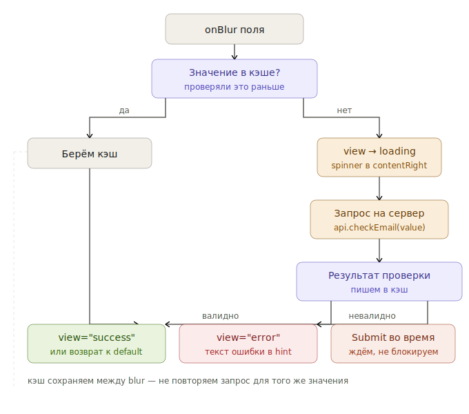

# Как добавить валидацию

Когда показывать ошибку, как её отображать, что делать с async-проверками. Сценарии и правила.

---

## Главное правило

**Не показывайте ошибку на пустом нетронутом поле.** Это самая частая ошибка в формах: пользователь открыл форму, все поля красные, ничего не понятно. Всегда ждите события — `onBlur` или `submit`.

---

## Когда показывать ошибку

| Ситуация | Когда показать |
|---|---|
| Формат явно неверен (буквы в номере телефона) | Сразу при вводе |
| Слишком короткое значение, неправильный email | На `onBlur` (пользователь покинул поле) |
| Поле обязательно, но пустое | При `submit` |
| Server-side ошибка (email уже занят) | После запроса, на `onBlur` или после submit |

---

## Состояния валидации

У полей ввода — четыре значения `view`:

| `view` | Когда |
|---|---|
| `default` | Поле не тронуто или данные корректны |
| `error` | Данные невалидны, требуется исправление |
| `warning` | Данные допустимы, но могут вызвать проблемы |
| `success` | Подтверждённая корректность (используйте редко) |

`view="success"` нужен только там, где визуальное подтверждение критично — например, проверка доступности логина. В остальных случаях не подсвечивайте успешные поля: это шум.

---

## Базовый паттерн

```tsx
const [email, setEmail] = useState('');
const [error, setError] = useState<string | null>(null);

function validate(value: string): string | null {
  if (!value) return 'Email обязателен';
  if (!value.includes('@')) return 'Введите корректный email';
  return null;
}

<TextField
  size="m"
  label="Email"
  labelPlacement="outer"
  required
  view={error ? 'error' : 'default'}
  hint={error ?? 'mail@example.com'}
  value={email}
  onChange={(e) => {
    setEmail(e.target.value);
    if (error) setError(null);              // ← очищаем ошибку при правке
  }}
  onBlur={() => setError(validate(email))}
/>
```

Что важно:

- **Ошибка очищается на onChange**, не на следующем blur. Иначе пользователь не понимает, исправил он или нет.
- **Hint и текст ошибки — одно и то же место.** В `default` показывается подсказка, в `error` — текст ошибки.

---

## Submit и проверка всей формы

```tsx
function handleSubmit(e: React.FormEvent) {
  e.preventDefault();

  const errors = {
    email: validate(email),
    name: name ? null : 'Имя обязательно',
    phone: validatePhone(phone),
  };

  if (Object.values(errors).some(Boolean)) {
    setErrors(errors);
    // Фокус на первое поле с ошибкой
    document.querySelector<HTMLInputElement>('[aria-invalid="true"]')?.focus();
    return;
  }

  api.submit({ email, name, phone });
}
```

Правила:

- **Проверяйте все поля сразу при submit**, а не только то, в котором был фокус.
- **Фокус — на первое поле с ошибкой.** Так пользователь сразу видит, что чинить.
- `aria-invalid="true"` SDDS добавляет автоматически при `view="error"` — селектор сработает.

---

## Async-валидация (например, проверка email)

Используйте, когда нужно обратиться к серверу: уникальность, доступность.

```tsx
const [emailStatus, setEmailStatus] = useState<'idle' | 'checking' | 'valid' | 'taken'>('idle');

async function checkEmail(value: string) {
  setEmailStatus('checking');
  const taken = await api.isEmailTaken(value);
  setEmailStatus(taken ? 'taken' : 'valid');
}

<TextField
  size="m"
  label="Email"
  view={emailStatus === 'taken' ? 'error' : emailStatus === 'valid' ? 'success' : 'default'}
  hint={
    emailStatus === 'taken' ? 'Этот email уже зарегистрирован' :
    emailStatus === 'valid' ? 'Email свободен' :
    'mail@example.com'
  }
  contentRight={emailStatus === 'checking' ? <Spinner size="xs" /> : null}
  value={email}
  onChange={(e) => { setEmail(e.target.value); setEmailStatus('idle'); }}
  onBlur={() => email && checkEmail(email)}
/>
```

Что важно:

- **Loading-индикатор в `contentRight`**, не вместо поля. Пользователь продолжает видеть введённое.
- **Кэшируйте результат** — не запрашивайте повторно при том же значении.
- **При submit, если запрос ещё идёт** — дождитесь его (или повторите синхронно). Не отправляйте форму с непроверенным email.
- **Не блокируйте submit-кнопку при checking** — покажите loading на кнопке.

Полный flow от blur до результата:




---

## Field-level vs form-level

| Уровень | Где | Когда |
|---|---|---|
| Поле | `view="error"` + hint под полем | Всегда |
| Форма | Summary-блок в начале/конце формы | Если ошибок > 3 |

Form-level summary нужен, когда полей с ошибками много и пользователь не видит их все на экране. До трёх ошибок field-level хватает.

```tsx
{Object.entries(errors).filter(([, e]) => e).length > 3 && (
  <Notification view="negative">
    Проверьте поля: найдено {errorCount} ошибок
  </Notification>
)}
```

---

## Warning vs Error

| | `view="error"` | `view="warning"` |
|---|---|---|
| Блокирует submit | ✓ | ✗ |
| Когда использовать | Данные невалидны | Данные допустимы, но рискованны |
| Пример | «Введите корректный email» | «Этот пароль использовался ранее» |

Warning не должен мешать пользователю продолжить. Если данные нельзя принять — это error, не warning.

---

## Чек-лист хорошей валидации

- [ ] На пустой нетронутой форме нет красных полей
- [ ] Ошибка появляется на `onBlur` (или на `submit` для пустых обязательных)
- [ ] Ошибка очищается на `onChange`, не ждёт следующего blur
- [ ] Текст ошибки объясняет, что не так — не просто «Ошибка»
- [ ] При submit фокус переходит на первое поле с ошибкой
- [ ] Async-проверки показывают спиннер, не блокируют ввод
- [ ] Server-side ошибки (5xx, сеть) — отдельный Toast, не error на поле

---

## Куда дальше

- [Reference: состояния](../reference/states.md) — все состояния, в т.ч. валидационные
- [Reference: модель валидации](../foundations/validation-model.md) — формальная спецификация
- [Концепт: почему `error` ≠ `negative`](../concepts/view-vs-validation.md)
