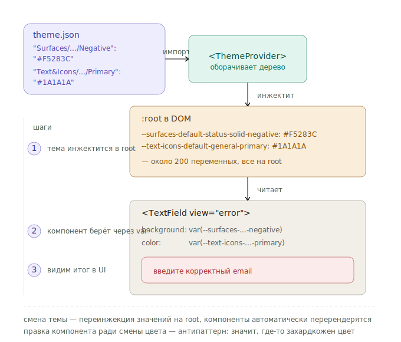

# Как подключить тему продукта в коде

Инструкция для разработчика: подключить тему, переключать темы на лету, отлаживать проблемы тематизации.

---

## Базовое подключение

В корне приложения оберните дерево в `<ThemeProvider>`:

```tsx
import { ThemeProvider } from '@sdds/ui';
import productTheme from './themes/my-product.json';

export function App() {
  return (
    <ThemeProvider theme={productTheme}>
      <Router />
    </ThemeProvider>
  );
}
```

`ThemeProvider` инжектит CSS-переменные в `:root`. Каждая переменная — это токен:

```css
:root {
  --text-icons-default-general-primary: #1A1A1A;
  --surfaces-default-status-solid-negative: #F5283C;
  /* … около 200 переменных */
}
```

Все компоненты SDDS внутри `<ThemeProvider>` подтянут цвета автоматически.

Что физически происходит между `theme.json` и итоговым UI:



---

## Структура объекта темы

Объект темы — это маппинг токенов на конкретные значения:

```json
{
  "name": "my-product-light",
  "tokens": {
    "Text&Icons/Default/General/Primary": "#1A1A1A",
    "Text&Icons/Default/General/Secondary": "#888888",
    "Surfaces/Default/General/Solid/Card": "#FFFFFF",
    "Surfaces/Default/Status/Solid/Negative": "#F5283C",
    "Outlines/Default/Status/Solid/Negative": "#F5283C"
  }
}
```

В проекте обычно держат отдельные файлы:

```
themes/
  my-product-light.json
  my-product-dark.json
  my-product-on-dark.json     # для тёмных секций
```

Полный список токенов → [reference/tokens.md](../reference/tokens.md).

---

## Переключение темы на лету

Для toggle светлая/тёмная или brand-switch:

```tsx
import { useState } from 'react';
import { ThemeProvider } from '@sdds/ui';
import lightTheme from './themes/light.json';
import darkTheme from './themes/dark.json';

export function App() {
  const [mode, setMode] = useState<'light' | 'dark'>('light');

  return (
    <ThemeProvider theme={mode === 'light' ? lightTheme : darkTheme}>
      <button onClick={() => setMode(m => m === 'light' ? 'dark' : 'light')}>
        Сменить тему
      </button>
      <Router />
    </ThemeProvider>
  );
}
```

Переключение — мгновенное, без перезагрузки. CSS-переменные обновляются на `:root`, все компоненты перерендериваются с новыми значениями.

---

## Контексты внутри темы

Не путать со сменой темы. Контекст — это «на какой поверхности я нахожусь»:

| Контекст | Когда |
|---|---|
| `Default` | Основной фон страницы |
| `Inverse` | Перевёрнутый: тёмная секция в светлой теме или наоборот |
| `onDark` | Гарантированно тёмный фон, не зависит от темы |
| `onLight` | Гарантированно светлый фон, не зависит от темы |

Контекст используется внутри одного приложения. Например, hero-секция всегда тёмная — внутри неё текст должен быть `Text&Icons/onDark/General/Primary`, а не `Default`.

```tsx
<div className="hero">
  {/* всё внутри использует onDark-токены */}
  <h1 style={{ color: 'var(--text-icons-on-dark-general-primary)' }}>
    Добро пожаловать
  </h1>
</div>
```

Большинство компонентов SDDS принимают проп `context` или сами определяют контекст по поверхности. Уточните у команды SDDS, как у конкретного компонента.

---

## Если цвет не подтягивается

| Симптом | Причина | Решение |
|---|---|---|
| Компонент всегда в дефолтных цветах | Нет `<ThemeProvider>` в дереве | Оберните корень |
| Часть приложения в старой теме | Несколько `<ThemeProvider>` | Один на корень, не вкладывать без причины |
| После смены темы остался старый цвет в одном месте | Захардкоженный цвет в кастомном CSS | Используйте `var(--token-name)` |
| `var(--…)` показывает «invalid» в инспекторе | Опечатка в имени токена | Проверьте по [reference/tokens.md](../reference/tokens.md) |

---

## Использование токенов в кастомном CSS

Если вы пишете свой компонент и хотите, чтобы он подтягивал тему:

```css
.my-card {
  background: var(--surfaces-default-general-solid-card);
  color: var(--text-icons-default-general-primary);
  border: 1px solid var(--outlines-default-general-solid-tertiary);
  border-radius: var(--numbers-rounding-m);
}
```

Имя CSS-переменной — это токен в kebab-case, без `&` и без слешей. Используйте утилиту из `@sdds/ui`, если хотите получить имя из строкового токена:

```tsx
import { tokenToVar } from '@sdds/ui';

tokenToVar('Text&Icons/Default/General/Primary');
// → 'var(--text-icons-default-general-primary)'
```

---

## Куда дальше

- [Reference: токены](../reference/tokens.md) — полный список токенов
- [Концепт: почему семантические токены](../concepts/why-tokens.md)
- [Reference: состояния](../reference/states.md) — какие токены за какое состояние отвечают
